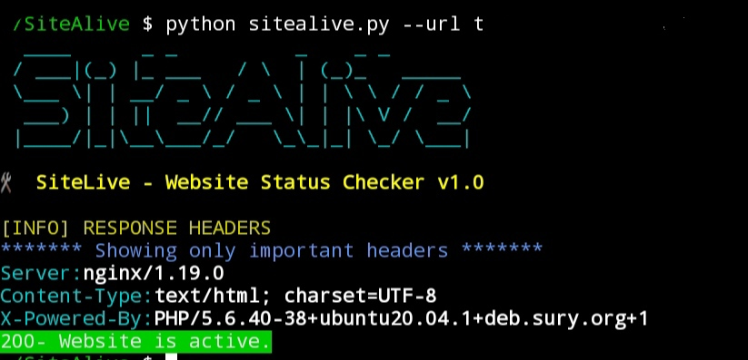

# 🌐 SiteAlive  


🛠️ **SiteAlive** is a simple, colorful Python CLI tool to check whether a website is active and optionally display its response headers. It’s great for quick uptime checks and learning basic Python, networking, and CLI development.

---
## 🔗 Table of Contents

1. [🚀 Features](#features)
2. [🔗 Usage](#usage)
3. [⚠️ Disclaimer](#disclaimer)
   
   
  
## Features

- Checks if a website is up and returns the HTTP status code
- Automatically prepends `http://` if not included
- Optionally displays important or all HTTP response headers
- Color-coded output for readability using `colorama`
- Beginner-friendly, with help text and usage examples

---

## 📦 Requirements

- Python 3.x
- `colorama`
- `requests`

## 🔗 Clone the repository
```bash
git clone https://github.com/gasanthosh/SiteAlive.git
```
## 📎 Installing Requirements
```bash
pip install -r requirements.txt
```
## Usage
```bash
python sitealive.py -h

SiteAlive - A tool to check if a website is alive.
options:
  -h, --help      show this help message and exit
  --url URL       Insert the url to check (e.g):google.com
  --show-headers  Display the headers


Example:
    python sitealive.py --url example.com
    python sitealive.py --url http://example.com
Note:
    You can skip http since it includes one by default.

                            -Developed by Santhosh
```
## 🖼️ Sample Output



## Disclaimer

This tool is intended for **educational and legitimate testing purposes only**. Do not use it to scan or test websites without **proper authorization**. The author is **not responsible for any misuse** of this script.
Use responsibly.
